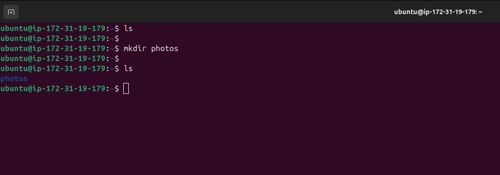
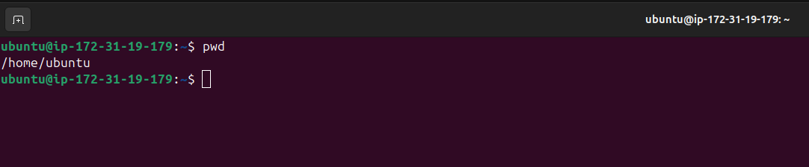
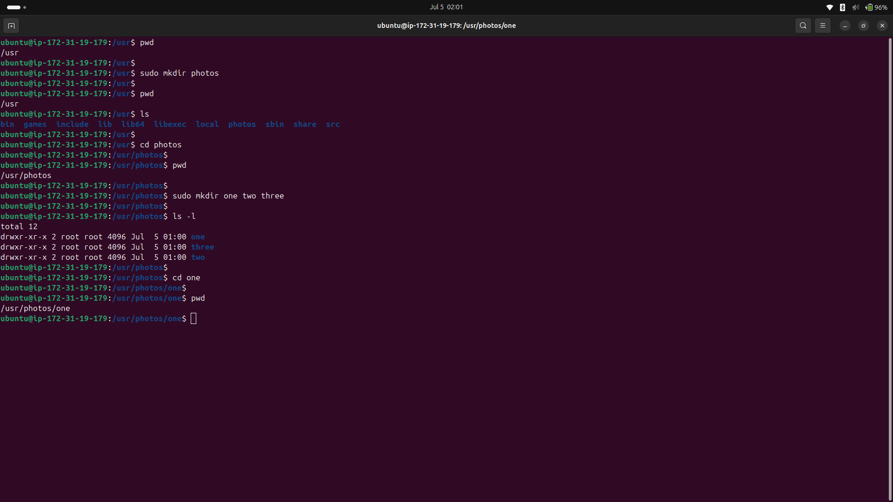

<!-- ABOUT THE PROJECT -->
## BASIC LINUX COMMANDS

### Objective

For this project, the following steps were taken to demonstrate basic linux commands:

- [BASIC LINUX COMMANDS](#basic-linux-commands)
  - [Objective](#objective)
    - [Linux Command](#linux-command)
    - [sudo command](#sudo-command)
    - [pwd command](#pwd-command)
    - [cd command](#cd-command)
    - [Practical example](#practical-example)
    - [ls command](#ls-command)
    - [cat command](#cat-command)
    - [cp command](#cp-command)
    - [mv command](#mv-command)
    - [rm command](#rm-command)
    - [touch command](#touch-command)
    - [find command](#find-command)

----

#### Linux Command

A linux command is a program or utility that runs in the CLI. It consists of a command name and optional options and parameters.
It is generally in the format of `command [options] [parameters]`.

Example with the ls command

Example with the mkdir command

----

#### sudo command

It allows a user to run commands with security privileges of another user.

Creation of folder in a restricted location without sudo command

Creation of folder in a restricted location with sudo command

----

#### pwd command

It allows a user to find the path of his/ her current working directory.

----

#### cd command

It allows a user to navigate through the files and directories.

----

#### Practical example
Example showing the creation of 3 random directories inside a newly created photos directory inside the **/usr** directory and printing the full path of one of the random directories.

----

#### ls command
It allows a user to lists files and directories.

----

#### cat command

It lists, combines and writes file contents to the terminal.

----

#### cp command
It is used to copy files or directories and their content.

----

#### mv command
It is used to move and rename files and directories.

----

#### rm command
It is used to delete files within a directory.

----

#### touch command
It is used to create an empty file.

----

#### find command
It is used to search for files within a specific directory.

----

